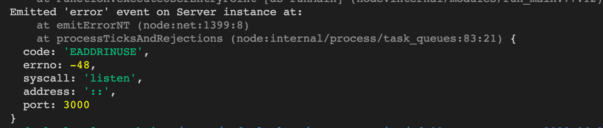

# Boas-vindas ao repositório do Projeto Store Manager! 🚀

<strong>🐳 Rodando no Docker vs Localmente</strong>

### 👉 Com Docker

**:warning: Antes de começar, seu docker-compose precisa estar na versão 1.29 ou superior. [Veja aqui](https://www.digitalocean.com/community/tutorials/how-to-install-and-use-docker-compose-on-ubuntu-20-04-pt) ou [na documentação](https://docs.docker.com/compose/install/) como instalá-lo. No primeiro artigo, você pode substituir onde está com `1.26.0` por `1.29.2`.**

> :information_source: Rode os serviços `node` e `db` com o comando `docker-compose up -d`.

- Lembre-se de parar o `mysql` se estiver usando localmente na porta padrão (`3306`), ou adapte, caso queria fazer uso da aplicação em containers;
- Esses serviços irão inicializar um container chamado `store_manager` e outro chamado `store_manager_db`;
- A partir daqui você pode rodar o container `store_manager` via CLI ou abri-lo no VS Code.

> :information_source: Opção 1: Use o comando `docker-compose run node npm test`, ou para acessar o container e executar lá:

> :information_source: Opção 2: Use o comando `docker exec -it store_manager bash` e sigas passos abaixo.

- Ele te dará acesso ao terminal interativo do container criado pelo compose, que está rodando em segundo plano.

> :information_source: Instale as dependências [**Caso existam**] com `npm install`

- **:warning: Atenção:** Caso opte por utilizar o Docker, **TODOS** os comandos disponíveis no `package.json` (npm start, npm test, npm run dev, ...) devem ser executados **DENTRO** do container, ou seja, no terminal que aparece após a execução do comando `docker exec` citado acima.

- **:warning: Atenção:** O **git** dentro do container não vem configurado com suas credenciais. Ou faça os commits fora do container, ou configure as suas credenciais do git dentro do container.

- **:warning: Atenção:** Não rode o comando npm audit fix! Ele atualiza várias dependências do projeto, e essa atualização gera conflitos com o avaliador.

- **:warning: Atenção:** Se você se deparar com o erro abaixo, quer dizer que sua aplicação já esta utilizando a `porta 3000`, seja com outro processo do Node.js (que você pode parar com o comando `killall node`) ou algum container! Neste caso você pode parar o container com o comando `docker stop <nome-do-container>`.



- ✨ **Dica:** Antes de iniciar qualquer coisa, observe os containers que estão em execução em sua máquina. Para ver os containers em execução basta usar o comando `docker container ls`, caso queira parar o container basta usar o comando `docker stop nomeContainer` e se quiser parar e excluir os containers, basta executar o comando `docker-compose down`

- ✨ **Dica:** A extensão `Remote - Containers` (que estará na seção de extensões recomendadas do VS Code) é indicada para que você possa desenvolver sua aplicação no container Docker direto no VS Code, como você faz com seus arquivos locais.


 <br />

### 👉 Sem Docker

> :information_source: Instale as dependências [**Caso existam**] com `npm install`

- **:warning: Atenção:** Não rode o comando npm audit fix! Ele atualiza várias dependências do projeto, e essa atualização gera conflitos com o avaliador.

- **:warning: Atenção:** Não esqueça de renomear/configurar o arquivo `.env.example` para os testes locais funcionarem.
- **:warning: Atenção:** Para rodar o projeto desta forma, **obrigatoriamente** você deve ter o `Node.js` instalado em seu computador.
- **:warning: Atenção:** A versão do `Node.js` e `NPM` a ser utilizada é `"node": ">=16.0.0"` e `"npm": ">=7.0.0"`, como descrito a chave `engines` no arquivo `package.json`. Idealmente deve-se utilizar o Node.js na `versão 16.14`, a versão na que esse projeto foi testado.

  <br/>

### :warning: Atenção aos arquivos de variáveis de ambiente

- Para os testes rodarem corretamente, na raiz do projeto **renomeie o arquivo `.env.example` para `.env`** com as variáveis de ambiente. Por exemplo, caso o seu usuário SQL seja `nome` e a senha `1234` seu arquivo ficará desta forma:

  ```sh
    MYSQL_HOST=localhost
    MYSQL_USER=nome
    MYSQL_PASSWORD=1234
    MYSQL_DATABASE=StoreManager
    PORT=3000
    HOST=localhost
  ```

  - **Variáveis de ambiente além das especificadas acima não são suportadas, pois não são esperadas pelo avaliador do projeto.**
    - A variável **PORT** do arquivo `.env` deve ser utilizada para a conexão com o servidor. É importante utilizar essa variável para os testes serem executados corretamente tanto na máquina local quanto no avaliador.
  - Com essas configurações, enquanto estiver na máquina local, o banco será executado normalmente via localhost (possibilitando os testes via `npm test`).
    Como o arquivo `.env` não será enviado para o GitHub (não se preocupe com isso, pois já está configurado no `.gitignore`), o avaliador utilizará as suas próprias variáveis de ambiente.

  ```javascript
  require("dotenv").config(); // não se esqueça de configurar suas variáveis de ambiente aqui na configuração

  const connection = mysql.createPool({
    host: process.env.MYSQL_HOST,
    user: process.env.MYSQL_USER,
    password: process.env.MYSQL_PASSWORD,
    database: process.env.MYSQL_DATABASE || "StoreManager",
  });
  ```

    <br />
<strong>🎲 Diagrama ER, Entidades e Scripts</strong>

#### Diagrama de Entidade-Relacionamento


---

#### Tabelas

O banco terá três tabelas:

- A tabela `products`, com os atributos `id` e `name`;
- A tabela `sales`, com os atributos `id` e `date`;
- A tabela `sales_products`, com os atributos `sale_id`, `product_id` e `quantity`;
- O script de criação do banco de dados pode ser visto [aqui](migration.sql);
- O script que popula o banco de dados pode ser visto [aqui](seed.sql);

**:warning: Atenção:** Não exclua, altere ou mova de lugar os arquivos `migration.sql` e `seed.sql`, eles são usados para realizar os testes. Qualquer dúvida sobre estes arquivos procure a monitoria no Slack ou nas mentorias.

A tabela `products` tem o seguinte formato: _(O id será gerado automaticamente)_


A tabela `sales` tem o seguinte formato: _(O id e date são gerados automaticamente)_


A tabela `sales_products`, é a tabela que faz o relacionamento `N:N` entre `products` e `sales` e tem o seguinte formato: _(O produto e a venda são deletados automaticamente)_


